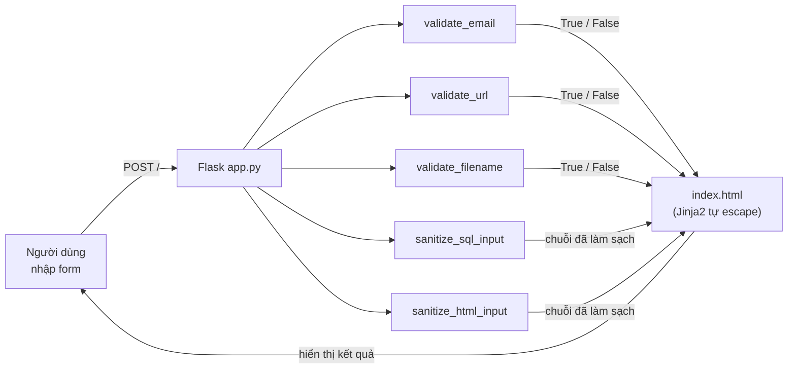
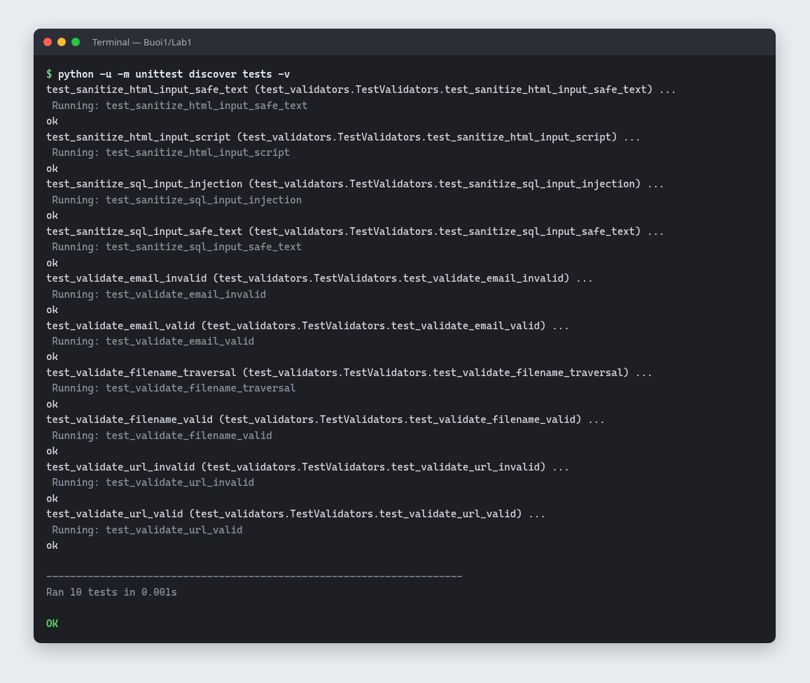
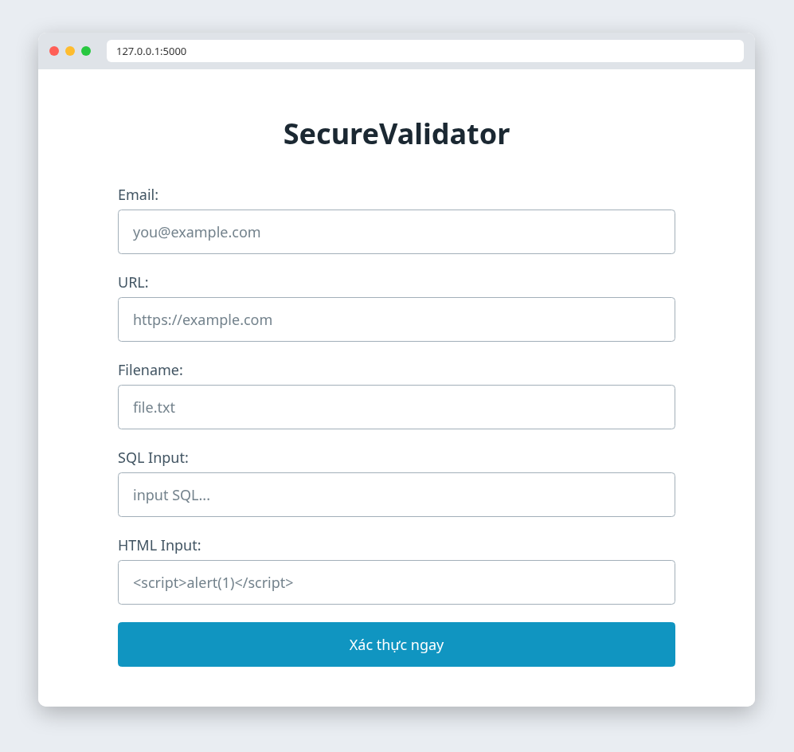
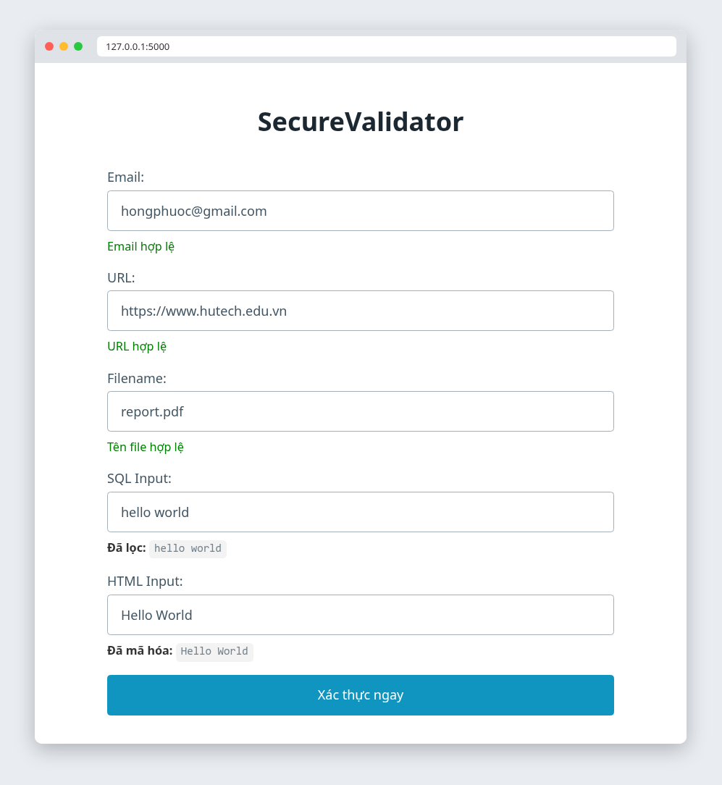
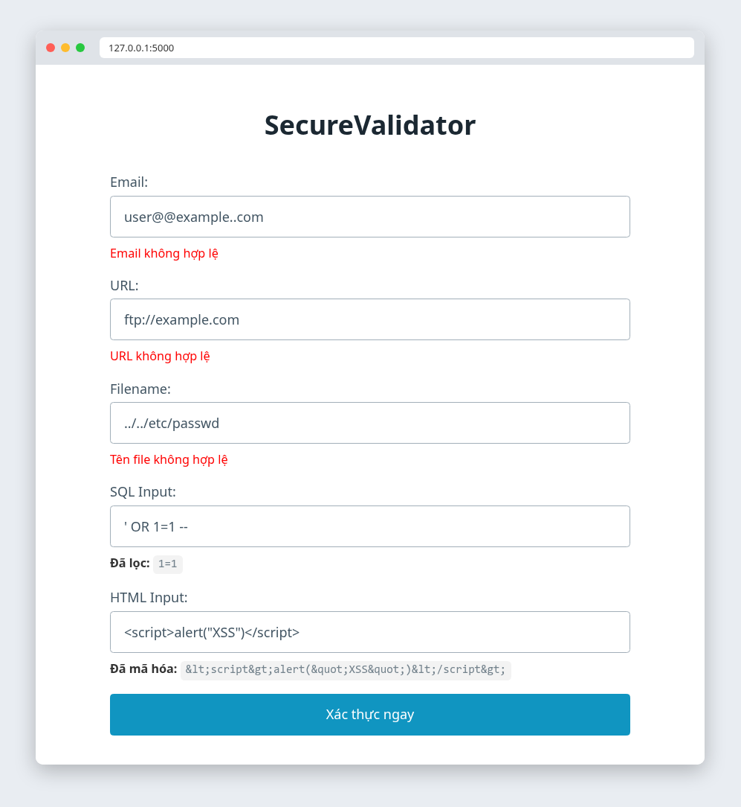
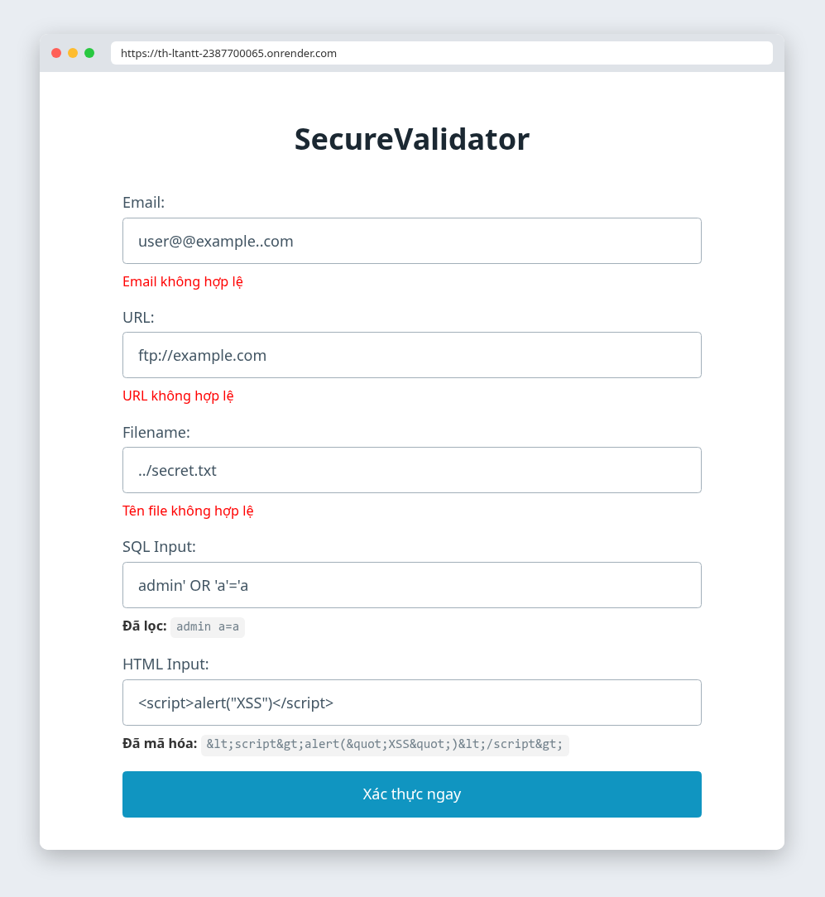
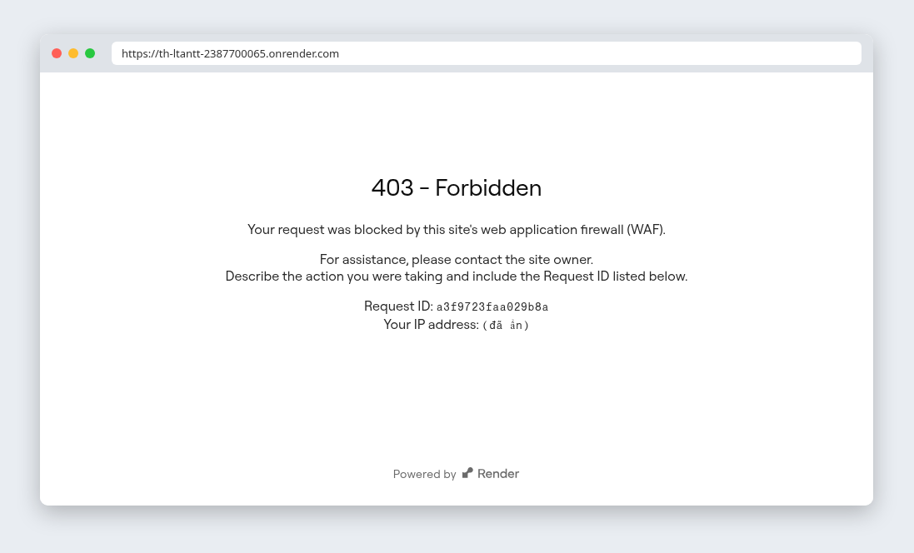

# Lab 1 – Thư viện xác thực đầu vào SecureValidator

| | |
|---|---|
| **Môn học** | Lập trình An ninh thông tin |
| **Buổi** | 1 – Cơ sở lập trình bảo mật, kiểm tra đầu vào (mục 1.2) |
| **Sinh viên** | Bùi Quang Thiện – 2387700065 |
| **Demo trực tuyến** | https://th-ltantt-2387700065.onrender.com |

## 1. Mục tiêu

Xây dựng thư viện Python **SecureValidator** để kiểm tra (validation) và làm sạch (sanitization)
dữ liệu đầu vào, giúp ứng dụng chống lại các lỗ hổng phổ biến trong **OWASP Top 10**.
Thư viện được dùng trong một ứng dụng web Flask, có bộ unit test, và được deploy lên Render.

## 2. Kỹ năng đạt được

| Kỹ năng | Áp dụng trong bài |
|---|---|
| Kiểm tra dữ liệu đầu vào (Input Validation) | Dùng regex và whitelist để xác định email, URL, tên file hợp lệ |
| Làm sạch dữ liệu (Sanitization) | Loại ký tự và từ khoá SQL nguy hiểm; escape HTML |
| Phòng chống SQL Injection | `sanitize_sql_input()` vô hiệu hoá payload `' OR 1=1 --` |
| Phòng chống XSS | `sanitize_html_input()` biến `<script>` thành văn bản vô hại |
| Phòng chống Path Traversal | `validate_filename()` chặn `../../etc/passwd` |
| Phòng chống SSRF cơ bản | `validate_url()` chỉ cho phép `http` và `https` |
| Nguyên tắc Whitelist hơn Blacklist | So sánh hai cách trong `validate_email()` và `sanitize_sql_input()` |
| Viết unit test cho mã bảo mật | 10 test case với `unittest`, gồm cả dữ liệu hợp lệ và độc hại |
| Xây dựng ứng dụng web với Flask và Jinja2 | Form nhập liệu, hiển thị kết quả, template tự escape |
| Deploy ứng dụng lên cloud | Đóng gói bằng Docker, chạy gunicorn trên Render |
| Phân tích và đánh giá hạn chế | Kiểm thử thêm các trường hợp biên, đề xuất cải tiến (mục 8) |

## 3. Công nghệ sử dụng

| Công nghệ | Vai trò |
|---|---|
| Python 3 (`re`, `html`, `urllib.parse`, `os`) | Cài đặt thư viện SecureValidator, không cần thư viện ngoài |
| Flask 2.3.3 và Jinja2 | Giao diện web minh hoạ |
| unittest | Kiểm thử đơn vị |
| gunicorn 21.2.0 | WSGI server khi chạy production |
| Docker | Đóng gói ứng dụng |
| Render | Nền tảng deploy (gói Free) |
| Git và GitHub | Quản lý mã nguồn |

## 4. Luồng xử lý



Khi deploy trên Render, request còn đi qua **tường lửa ứng dụng web (WAF)** của Render trước khi tới app (xem mục 6.3).

## 5. Cấu trúc thư mục

```
Lab1/
├── app.py                     # Flask app
├── securevalidator/
│   ├── __init__.py
│   └── core.py                # 5 hàm validate / sanitize
├── templates/index.html       # Giao diện form
├── tests/test_validators.py   # 10 unit test
├── images/                    # Hình minh hoạ cho README
├── requirements.txt
├── Dockerfile
└── render.yaml
```

## 6. Chức năng

| Hàm | Lỗ hổng phòng chống | Cách hoạt động | Ví dụ bị chặn hoặc làm sạch |
|---|---|---|---|
| `validate_email(email)` | Injection trong email | Regex whitelist `^[\w\.-]+@[\w\.-]+\.\w+$`, so khớp toàn bộ chuỗi | `user@@example..com`, `x@y.com<script>` |
| `validate_url(url)` | SSRF | Chỉ chấp nhận scheme `http`/`https` và bắt buộc có host | `ftp://example.com`, `javascript:alert(1)` |
| `validate_filename(filename)` | Path Traversal | Từ chối `..`, `/`, `\`; tên phải trùng `basename` | `../../etc/passwd` |
| `sanitize_sql_input(input_str)` | SQL Injection | Xoá `--`, `;`, `'`, `"`, `#` và các từ khoá `OR`, `AND`, `SELECT`, `DROP`, `UNION`, … | `' OR 1=1 --` thành `1=1` |
| `sanitize_html_input(html_str)` | XSS | `html.escape()`: đổi `< > & " '` thành HTML entity | `<script>` thành `&lt;script&gt;` |

## 7. Kết quả thực hiện

### 7.1 Unit test: 10/10 test đạt



| # | Test case | Đầu vào | Kết quả mong đợi | Loại dữ liệu | Kết quả |
|---|---|---|---|---|---|
| 1 | `test_validate_email_valid` | `user@example.com` | `True` | Hợp lệ | Đạt |
| 2 | `test_validate_email_invalid` | `user@@example..com` | `False` | Độc hại | Đạt |
| 3 | `test_validate_url_valid` | `https://example.com` | `True` | Hợp lệ | Đạt |
| 4 | `test_validate_url_invalid` | `ftp://example.com` | `False` | Độc hại | Đạt |
| 5 | `test_validate_filename_valid` | `report.pdf` | `True` | Hợp lệ | Đạt |
| 6 | `test_validate_filename_traversal` | `../../etc/passwd` | `False` | Độc hại | Đạt |
| 7 | `test_sanitize_sql_input_injection` | `' OR 1=1 --` | không còn `'`, `--`, `OR` | Độc hại | Đạt |
| 8 | `test_sanitize_sql_input_safe_text` | `hello world` | giữ nguyên | Hợp lệ | Đạt |
| 9 | `test_sanitize_html_input_script` | `<script>alert("XSS")</script>` | `&lt;script&gt;alert(&quot;XSS&quot;)&lt;/script&gt;` | Độc hại | Đạt |
| 10 | `test_sanitize_html_input_safe_text` | `Hello World` | giữ nguyên | Hợp lệ | Đạt |

### 7.2 Giao diện web

| Giao diện ban đầu | Dữ liệu hợp lệ | Dữ liệu độc hại |
|---|---|---|
|  |  |  |

| Ô nhập | Dữ liệu hợp lệ | Kết quả | Dữ liệu độc hại | Kết quả |
|---|---|---|---|---|
| Email | `hongphuoc@gmail.com` | Email hợp lệ | `user@@example..com` | Email không hợp lệ |
| URL | `https://www.hutech.edu.vn` | URL hợp lệ | `ftp://example.com` | URL không hợp lệ |
| Filename | `report.pdf` | Tên file hợp lệ | `../../etc/passwd` | Tên file không hợp lệ |
| SQL Input | `hello world` | `hello world` | `' OR 1=1 --` | `1=1` |
| HTML Input | `Hello World` | `Hello World` | `<script>alert("XSS")</script>` | `&lt;script&gt;alert(&quot;XSS&quot;)&lt;/script&gt;` |

### 7.3 Ứng dụng trên Render

| Dữ liệu độc hại được app xử lý | Payload bị WAF của Render chặn |
|---|---|
|  |  |

Khi gửi các payload quá rõ ràng như `../../etc/passwd` hay `' OR 1=1 --` lên bản deploy,
**tường lửa ứng dụng web (WAF)** mà Render đặt phía trước (chạy trên Cloudflare) trả về
**403 Forbidden** ngay, request không tới được ứng dụng. Đây là ví dụ thực tế cho nguyên tắc
**Defense in Depth**: WAF ở biên mạng là một lớp bảo vệ, lớp validate trong code là lớp thứ hai.
Địa chỉ IP trong ảnh đã được ẩn.

| Payload | WAF của Render | Lớp SecureValidator |
|---|---|---|
| `../../etc/passwd` | Chặn (403) | – |
| `' OR 1=1 --` | Chặn (403) | – |
| `../secret.txt` | Cho qua | Tên file không hợp lệ |
| `admin' OR 'a'='a` | Cho qua | Đã lọc: `admin  a=a` |
| `<script>alert("XSS")</script>` | Cho qua | Đã mã hoá thành HTML entity |

## 8. Hạn chế và hướng cải tiến

Kết quả chạy thử thêm các trường hợp biên:

| Hàm | Đầu vào | Kết quả thực tế | Vấn đề | Hướng cải tiến |
|---|---|---|---|---|
| `validate_url` | `http://169.254.169.254/latest/meta-data` | `True` | Chưa chặn địa chỉ nội bộ (metadata cloud) | Phân giải host, dùng `ipaddress` loại loopback, private, link-local |
| `validate_url` | `http://127.0.0.1`, `http://localhost:8080` | `True` | SSRF vào chính máy chủ | Như trên, hoặc whitelist domain |
| `validate_filename` | `""`, `.env` | `True` | Chấp nhận chuỗi rỗng và file ẩn | Kiểm tra độ dài, chặn tên bắt đầu bằng `.`, whitelist đuôi file |
| `sanitize_sql_input` | `O'Brien` | `OBrien` | Blacklist làm hỏng dữ liệu hợp lệ | Dùng **parameterized query**, cách OWASP khuyến nghị |
| `sanitize_sql_input` | `Bob or Alice` | `Bob  Alice` | Xoá nhầm từ thông thường | Như trên |
| `validate_email` | `user+tag@gmail.com` | `False` | Từ chối email hợp lệ | Dùng thư viện `email-validator` |

## 9. Điều chỉnh so với tài liệu hướng dẫn

| Nội dung | Tài liệu | Bài làm | Lý do |
|---|---|---|---|
| Chế độ debug | `app.run(debug=True)` | Chỉ bật khi `FLASK_DEBUG=1` | Debugger Werkzeug cho phép thực thi mã từ xa (Bandit B201, mức High) |
| Test `safe_text` của HTML | Thiếu `assertEqual` | Đã bổ sung | Test phải có kiểm tra thì mới có ý nghĩa |
| Deploy | Runtime Python | Docker (`Dockerfile`) | Service Render được tạo ở chế độ Docker |

## 10. Tài liệu tham khảo

- [OWASP Input Validation Cheat Sheet](https://cheatsheetseries.owasp.org/cheatsheets/Input_Validation_Cheat_Sheet.html)
- [OWASP SQL Injection Prevention Cheat Sheet](https://cheatsheetseries.owasp.org/cheatsheets/SQL_Injection_Prevention_Cheat_Sheet.html)
- [OWASP XSS Prevention Cheat Sheet](https://cheatsheetseries.owasp.org/cheatsheets/Cross_Site_Scripting_Prevention_Cheat_Sheet.html)
- [OWASP SSRF Prevention Cheat Sheet](https://cheatsheetseries.owasp.org/cheatsheets/Server_Side_Request_Forgery_Prevention_Cheat_Sheet.html)
