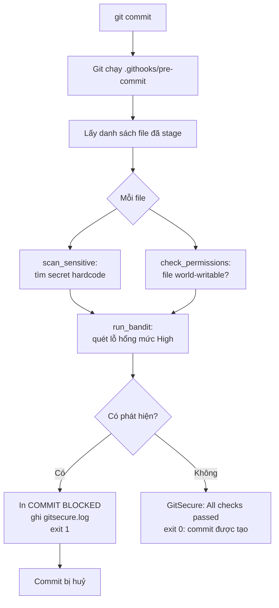
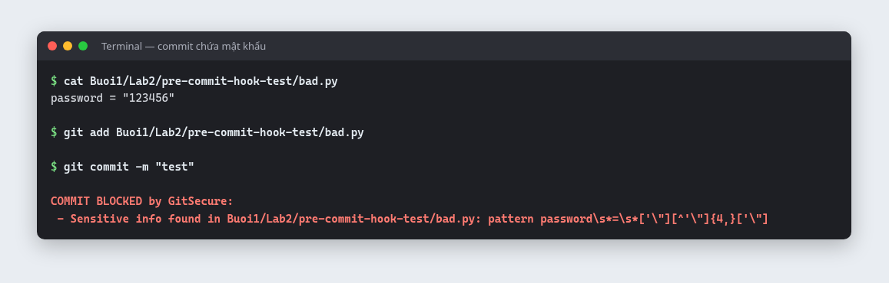
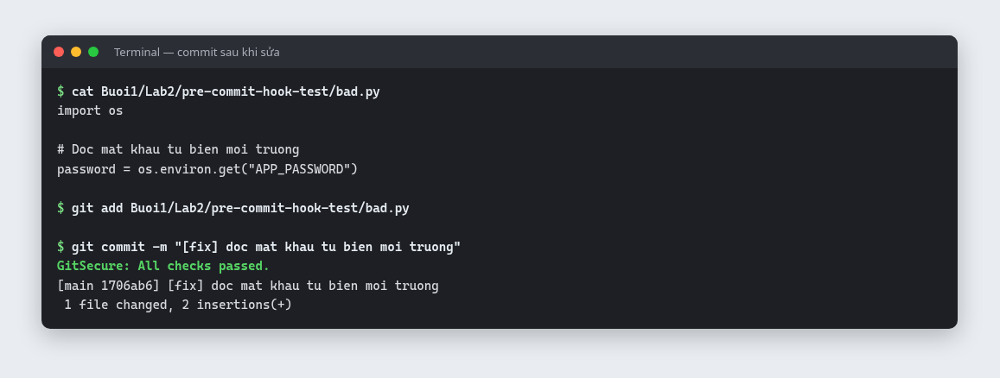
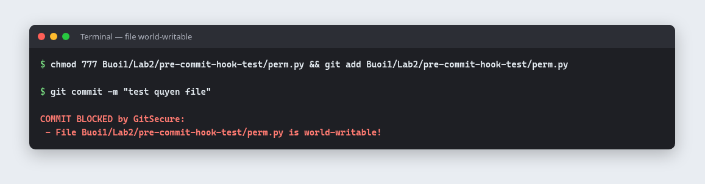
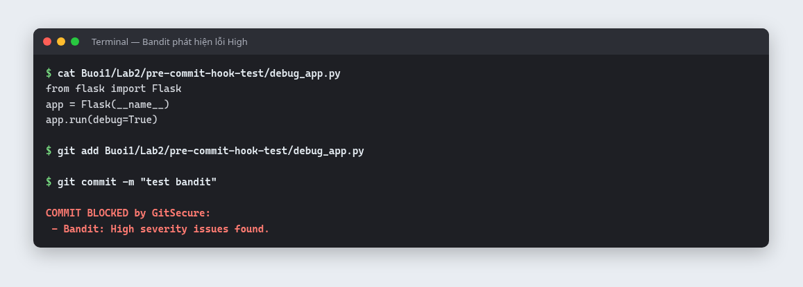
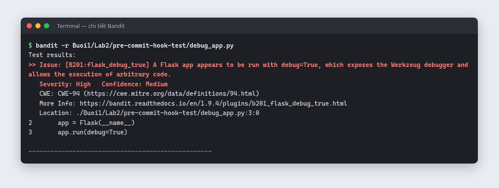
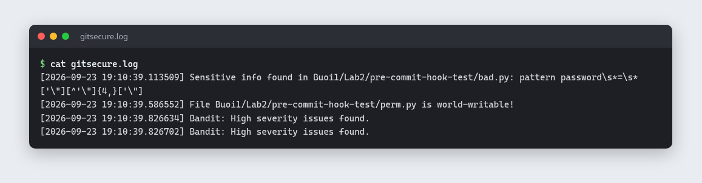

# Lab 2 – Bảo mật trước khi commit: GitSecure

| | |
|---|---|
| **Môn học** | Lập trình An ninh thông tin |
| **Buổi** | 1 – Cơ sở lập trình bảo mật, kiểm tra đầu vào (mục 1.4) |
| **Sinh viên** | Bùi Quang Thiện – 2387700065 |

## 1. Mục tiêu

Thiết kế và triển khai **GitSecure**, một Git **pre-commit hook** tự động kiểm tra mã nguồn trước
mỗi lần `git commit`. Hook phát hiện thông tin nhạy cảm, file bị phân quyền sai và lỗ hổng trong
mã. Nếu có vấn đề, hook **chặn commit** và ghi chi tiết vào `gitsecure.log`.

## 2. Kỹ năng đạt được

| Kỹ năng | Áp dụng trong bài |
|---|---|
| Hiểu cơ chế Git hooks | Hook `pre-commit` chạy trước khi commit; mã thoát khác 0 thì Git huỷ commit |
| Quản lý hook trong repo | Dùng `git config core.hooksPath` để hook được quản lý phiên bản cùng mã nguồn |
| Phát hiện secret bị hardcode | Regex nhận diện `password`, `secret`, `token`, `apikey`, AWS Access Key |
| Quét lỗ hổng bằng công cụ SAST | Tích hợp **Bandit**, chặn khi có lỗi mức High |
| Kiểm tra quyền truy cập file | Dùng `os.stat` phát hiện file world-writable (quyền 777) |
| Ghi log phục vụ điều tra | Mỗi phát hiện được ghi kèm thời gian vào `gitsecure.log` |
| Tự động hoá kiểm tra bảo mật (shift-left) | Lỗi được bắt ngay tại máy lập trình viên, trước khi lên repo |
| Quản lý secret đúng cách | Thay mật khẩu cứng bằng biến môi trường `os.environ` |
| Đọc hiểu và sửa lỗi mã nguồn | Phát hiện lỗi khiến Bandit không bao giờ chặn trong code gốc (mục 8) |

## 3. Công nghệ sử dụng

| Công nghệ | Vai trò |
|---|---|
| Git hooks (`pre-commit`) | Điểm móc để chạy kiểm tra trước commit |
| Python 3 (`re`, `os`, `stat`, `subprocess`) | Viết script hook |
| Bandit | Phân tích tĩnh (SAST) tìm lỗ hổng trong mã Python |
| `git diff --cached --name-only` | Lấy danh sách file đã được stage |

## 4. Luồng xử lý



## 5. Cấu trúc thư mục

```
Lab2/
├── .githooks/
│   └── pre-commit             # Script GitSecure (Python, có quyền thực thi)
├── pre-commit-hook-test/
│   └── bad.py                 # File mẫu để thử hook
├── images/                    # Hình minh hoạ cho README
└── requirements.txt           # bandit
```

Hook được gắn cho cả repo bằng `git config core.hooksPath Buoi1/Lab2/.githooks`.
File `gitsecure.log` nằm ở thư mục gốc repo và đã được đưa vào `.gitignore`.

## 6. Chức năng

### 6.1 Các thành phần kiểm tra

| Hàm | Kiểm tra | Điều kiện chặn commit |
|---|---|---|
| `scan_sensitive(file)` | Thông tin nhạy cảm, thông tin xác thực bị cài cứng | Nội dung file khớp một mẫu trong bảng 6.2 |
| `check_permissions(file)` | Quyền truy cập file | Bit `S_IWOTH` bật (ai cũng ghi được); bỏ qua trên Windows |
| `run_bandit()` | Lỗ hổng trong mã Python | Bandit báo lỗi mức **High**, hoặc chưa cài Bandit |
| `log(msg)` | Ghi nhật ký | Ghi mọi phát hiện kèm thời gian vào `gitsecure.log` |

### 6.2 Mẫu thông tin nhạy cảm

| Loại | Regex | Độ dài tối thiểu của giá trị |
|---|---|---|
| API key | `apikey\s*=\s*['\"][A-Za-z0-9_\-]{16,}['\"]` | 16 |
| Secret | `secret\s*=\s*['\"][A-Za-z0-9_\-]{8,}['\"]` | 8 |
| Mật khẩu | `password\s*=\s*['\"][^'\"]{4,}['\"]` | 4 |
| Token | `token\s*=\s*['\"][A-Za-z0-9]{10,}['\"]` | 10 |
| AWS Access Key | `(AKIA\|ASIA)[A-Z0-9]{16}` | 16 ký tự sau tiền tố |

Tất cả được so khớp **không phân biệt hoa thường**.

## 7. Kết quả thực hiện

### 7.1 Tổng hợp kịch bản kiểm thử

| # | Kịch bản | File commit | Kết quả mong đợi | Kết quả thực tế |
|---|---|---|---|---|
| 1 | Mật khẩu hardcode | `bad.py` gán mật khẩu cứng | Chặn | Chặn: *Sensitive info found* |
| 2 | Đã sửa, dùng biến môi trường | `bad.py` dùng `os.environ.get(...)` | Cho commit | *All checks passed*, commit được tạo |
| 3 | File quyền 777 | `perm.py` sau `chmod 777` | Chặn | Chặn: *is world-writable!* |
| 4 | Lỗ hổng mức High | `debug_app.py` có `app.run(debug=True)` | Chặn | Chặn: *Bandit: High severity issues found* |

### 7.2 Kịch bản 1: commit chứa mật khẩu hardcode bị chặn



### 7.3 Kịch bản 2: sau khi thay bằng biến môi trường, commit thành công



### 7.4 Kịch bản 3: file world-writable bị chặn



### 7.5 Kịch bản 4: Bandit phát hiện lỗ hổng mức High



Chi tiết lỗi Bandit tìm được:



| Mã lỗi | Mô tả | Mức độ | CWE |
|---|---|---|---|
| B201 `flask_debug_true` | Flask chạy với `debug=True`, để lộ Werkzeug debugger và cho phép thực thi mã tuỳ ý | High | CWE-94 (Code Injection) |

### 7.6 Nhật ký `gitsecure.log`



Mỗi dòng ghi thời điểm, loại phát hiện và file liên quan. Người phụ trách có thể dùng log này để
xem xét và xử lý sau. Dòng Bandit xuất hiện hai lần vì code gốc gọi `log()` cả trong
`run_bandit()` lẫn trong `main()`.

### 7.7 Hook quét cả tài liệu

Khi viết README này, hook đã **chặn commit** vì trong README có dòng ví dụ gán mật khẩu cứng
giống hệt `bad.py`. Hook quét mọi file được commit, kể cả tài liệu. Vì vậy ví dụ đó được thể
hiện bằng hình ảnh thay vì ghi nguyên văn trong README.

## 8. Điều chỉnh so với tài liệu hướng dẫn

| Vấn đề trong code gốc | Hậu quả | Điều chỉnh |
|---|---|---|
| So khớp `"SEVERITY: High"` trong khi Bandit in ra `Severity: High` | Bandit **không bao giờ** chặn được commit | So khớp bằng regex không phân biệt hoa thường |
| `bandit -r .` quét cả thư mục `.venv` | Chậm, báo lỗi của thư viện bên thứ ba | Thêm `-x ./.venv` |
| `check_permissions` trả `False` trên Windows | Kiểu trả về không thống nhất | Trả `None` như các hàm khác |
| Shebang `#!/usr/bin/env python` | Nhiều bản Linux không có lệnh `python` | Đổi thành `python3` |

## 9. Hạn chế và hướng cải tiến

| Hạn chế | Hướng cải tiến |
|---|---|
| Chưa kiểm tra tuân thủ giấy phép thư viện | Dùng `pip-licenses` để liệt kê giấy phép và chặn giấy phép không phù hợp |
| Chỉ báo mẫu khớp đầu tiên, không có số dòng | Quét từng dòng và báo đầy đủ vị trí |
| Regex bỏ sót secret trong JSON/dict (`"password": "..."`) | Kết hợp Gitleaks, detect-secrets hoặc TruffleHog |
| Có thể bỏ qua hook bằng `git commit --no-verify` | Thêm kiểm tra phía server: GitHub Actions, secret scanning |
| Bandit quét cả repo ở mọi lần commit | Chỉ quét các file `.py` đã được stage |

## 10. Tài liệu tham khảo

- [Git Hooks – Pro Git](https://git-scm.com/book/en/v2/Customizing-Git-Git-Hooks)
- [Bandit Documentation](https://bandit.readthedocs.io)
- [OWASP Secrets Management Cheat Sheet](https://cheatsheetseries.owasp.org/cheatsheets/Secrets_Management_Cheat_Sheet.html)
- [Gitleaks](https://github.com/gitleaks/gitleaks)
