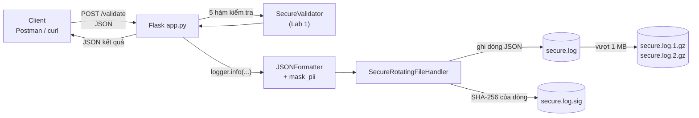
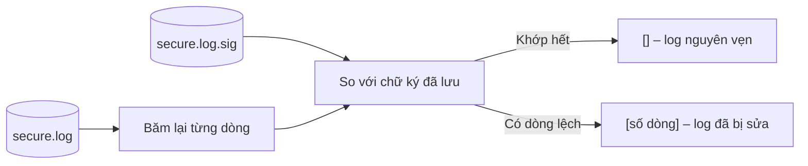
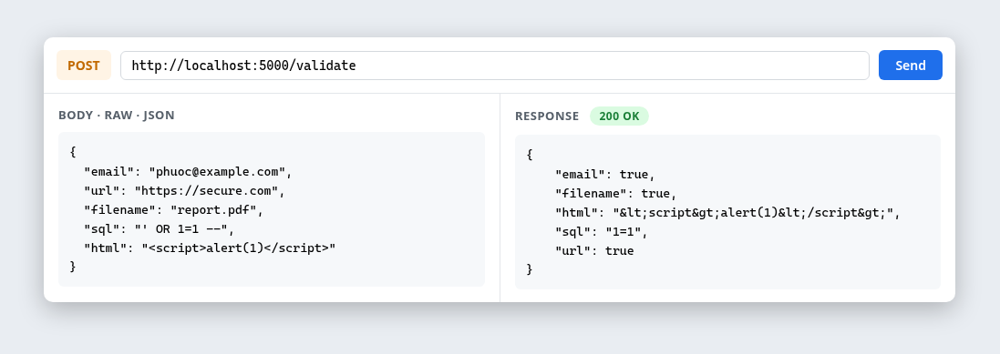
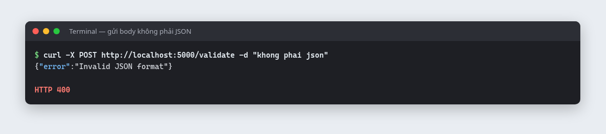
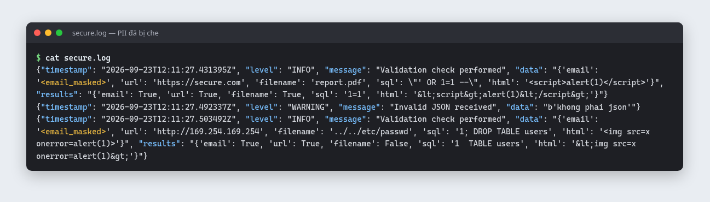
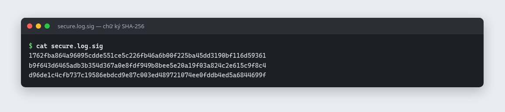
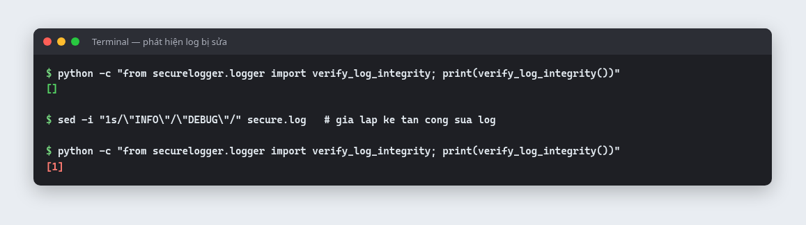

# Lab 3 – Ghi nhật ký ưu tiên bảo mật: SecureLogger

| | |
|---|---|
| **Môn học** | Lập trình An ninh thông tin |
| **Buổi** | 1 – Cơ sở lập trình bảo mật, kiểm tra đầu vào (mục 1.6) |
| **Sinh viên** | Bùi Quang Thiện – 2387700065 |

## 1. Mục tiêu

Xây dựng hệ thống ghi nhật ký **SecureLogger**. Logger ghi log dạng JSON, tự che thông tin cá
nhân (PII), luân phiên và nén file log, và phát hiện khi log bị sửa trái phép. SecureLogger được
tích hợp với thư viện **SecureValidator** (Lab 1) để ghi lại **mọi lần kiểm tra validation** qua API.

## 2. Kỹ năng đạt được

| Kỹ năng | Áp dụng trong bài |
|---|---|
| Sử dụng module `logging` nâng cao | Tự viết `Formatter`, `Handler` và `rotator` riêng |
| Ghi log có cấu trúc (JSON) | Mỗi sự kiện là một dòng JSON, dễ phân tích bằng công cụ SIEM |
| Bảo vệ dữ liệu cá nhân (PII) | Tự che email, token, mật khẩu trước khi ghi log |
| Phòng chống Log Injection | `json.dumps` escape ký tự xuống dòng, nên không giả mạo được dòng log |
| Đảm bảo toàn vẹn dữ liệu bằng hàm băm | Ký từng dòng log bằng SHA-256 và kiểm tra lại |
| Quản lý vòng đời log | Luân phiên khi đạt 1 MB, nén gzip, giữ tối đa 2 bản |
| Xử lý lỗi an toàn | Trả `400` với thông báo chung, không để lộ chi tiết lỗi |
| Xây dựng và kiểm thử REST API | Flask API `POST /validate`, kiểm thử bằng Postman và curl |
| Tích hợp module giữa các bài | Dùng lại SecureValidator của Lab 1 |

## 3. Công nghệ sử dụng

| Công nghệ | Vai trò |
|---|---|
| Python `logging`, `logging.handlers` | Nền tảng ghi log, đa cấp độ, luân phiên file |
| `json` | Định dạng log có cấu trúc |
| `re` | Nhận diện PII |
| `hashlib` (SHA-256) | Chữ ký cho từng dòng log |
| `gzip` | Nén log cũ |
| Flask | REST API `POST /validate` |
| Postman và curl | Gửi request kiểm thử |

## 4. Luồng xử lý





## 5. Cấu trúc thư mục

```
Lab3/
├── app.py                     # Flask API POST /validate
├── securelogger/
│   ├── __init__.py
│   └── logger.py              # SecureLogger
├── securevalidator/           # Sao chép từ Lab 1
├── images/                    # Hình minh hoạ cho README
└── requirements.txt
```

## 6. Chức năng

### 6.1 Các tính năng theo yêu cầu

| Yêu cầu | Thành phần | Mô tả |
|---|---|---|
| Đa cấp độ log | `logging` với mức `DEBUG` | Hỗ trợ đủ DEBUG, INFO, WARNING, ERROR, CRITICAL |
| Che PII | `mask_pii()` | Thay email và token/mật khẩu bằng `<email_masked>`, `<token_masked>` |
| Luân phiên và nén | `RotatingFileHandler` và `GZipRotator` | Tối đa 1 MB mỗi file, giữ 2 bản `.gz` |
| Phát hiện sửa đổi | `append_signature()`, `verify_log_integrity()` | Mỗi dòng log có một mã băm SHA-256 trong `secure.log.sig` |
| Log JSON | `JSONFormatter` | Gồm `timestamp` (UTC), `level`, `message`, `data`, `results` |

### 6.2 Quy tắc che PII

| Loại | Regex | Trước | Sau |
|---|---|---|---|
| Email | `[\w\.-]+@[\w\.-]+\.\w+` | `an@hutech.edu.vn` | `<email_masked>` |
| Token, mật khẩu, key | `(token\|apikey\|key\|password)\s*=\s*…{8,}` | `password=SuperSecret123` | `<token_masked>` |

### 6.3 API `POST /validate`

| Tình huống | HTTP | Response | Cấp độ log |
|---|---|---|---|
| Body là JSON hợp lệ | 200 | Kết quả của 5 hàm SecureValidator | `INFO` – "Validation check performed" |
| Body không phải JSON | 400 | `{"error": "Invalid JSON format"}` | `WARNING` – "Invalid JSON received" |

## 7. Kết quả thực hiện

### 7.1 Gửi request tới API



| Trường | Giá trị gửi | Kết quả trả về |
|---|---|---|
| `email` | `phuoc@example.com` | `true` |
| `url` | `https://secure.com` | `true` |
| `filename` | `report.pdf` | `true` |
| `sql` | `' OR 1=1 --` | `"1=1"` |
| `html` | `<script>alert(1)</script>` | `"&lt;script&gt;alert(1)&lt;/script&gt;"` |

### 7.2 Gửi body không phải JSON



Ứng dụng chỉ trả thông báo chung `Invalid JSON format`, không để lộ stack trace hay chi tiết lỗi.

### 7.3 Nội dung `secure.log`: PII đã bị che



| Dòng | Cấp độ | Sự kiện | Email trong log |
|---|---|---|---|
| 1 | INFO | Validation hợp lệ | `phuoc@example.com` thành `<email_masked>` |
| 2 | WARNING | Body không phải JSON | – |
| 3 | INFO | Validation với payload độc hại (`../../etc/passwd`, `DROP TABLE`, ``) | `an.nguyen@hutech.edu.vn` thành `<email_masked>` |

### 7.4 Chữ ký SHA-256 trong `secure.log.sig`



Mỗi dòng trong `secure.log.sig` là mã băm SHA-256 (64 ký tự hex) của dòng log tương ứng.

### 7.5 Phát hiện log bị sửa



| Bước | Thao tác | Kết quả `verify_log_integrity()` |
|---|---|---|
| 1 | Kiểm tra log vừa ghi | `[]`: log nguyên vẹn |
| 2 | Giả lập kẻ tấn công đổi `"INFO"` thành `"DEBUG"` ở dòng 1 | – |
| 3 | Kiểm tra lại | `[1]`: phát hiện dòng 1 đã bị sửa |

## 8. Điều chỉnh so với tài liệu hướng dẫn

| Vấn đề trong code gốc | Hậu quả | Điều chỉnh |
|---|---|---|
| `emit()` gọi `format()` hai lần, mỗi lần lấy `datetime.utcnow()` khác nhau | Dòng được ký lệch vài micro giây so với dòng được ghi, nên chữ ký **không bao giờ khớp** | Lấy timestamp từ `record.created` (cố định cho mỗi bản ghi) |
| `append_signature` ghi các mã băm nối liền nhau | Không đối chiếu được từng dòng | Mỗi mã băm nằm trên một dòng |
| Chỉ ghi chữ ký, không có hàm kiểm tra | Chưa thật sự "phát hiện" được việc sửa log | Thêm `verify_log_integrity()` |
| `datetime.utcnow()` | Deprecated từ Python 3.12 | Dùng `datetime.fromtimestamp(..., timezone.utc)` |
| `app.run(debug=True)` | Lộ debugger (Bandit B201) | Chỉ bật khi `FLASK_DEBUG=1` |

## 9. Hạn chế và hướng cải tiến

| Hạn chế | Hướng cải tiến |
|---|---|
| Kẻ có quyền ghi cả hai file có thể sửa log rồi tính lại SHA-256 | Dùng **HMAC-SHA256** với khoá bí mật, hoặc **hash chain** để phát hiện cả việc xoá dòng |
| Mới che email và token/mật khẩu | Bổ sung số điện thoại, số CCCD, số thẻ, địa chỉ IP |
| Mẫu `token` che nhầm mọi khoá có chữ `key` | Dùng danh sách tên trường cụ thể hơn |
| File `.sig` không luân phiên cùng file log | Luân phiên và nén `.sig` cùng lúc với log |
| Chưa giới hạn quyền truy cập file log | Đặt quyền `600`, chỉ tài khoản chạy ứng dụng được ghi |

## 10. Tài liệu tham khảo

- [OWASP Logging Cheat Sheet](https://cheatsheetseries.owasp.org/cheatsheets/Logging_Cheat_Sheet.html)
- [OWASP Log Injection](https://owasp.org/www-community/attacks/Log_Injection)
- [Python logging.handlers](https://docs.python.org/3/library/logging.handlers.html)
