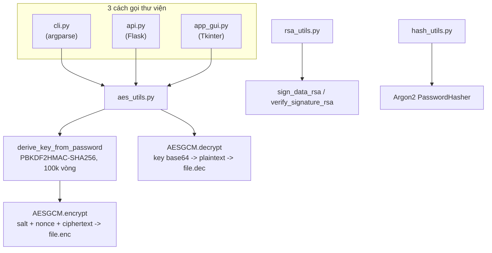
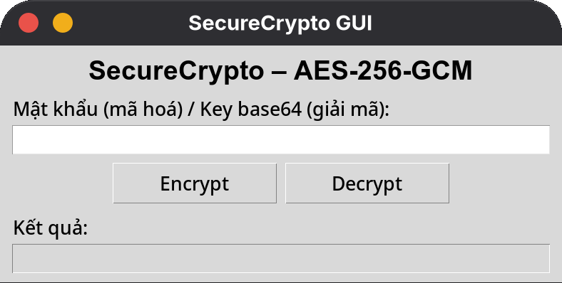
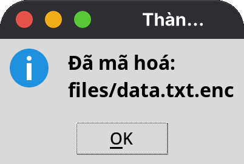
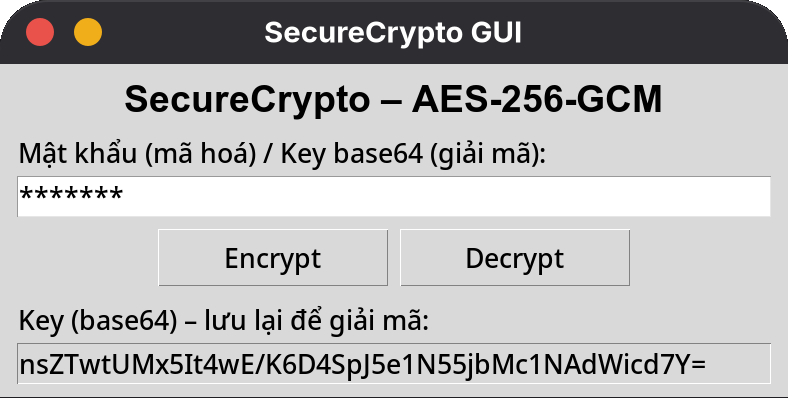
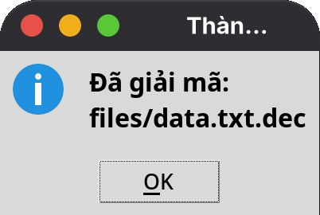
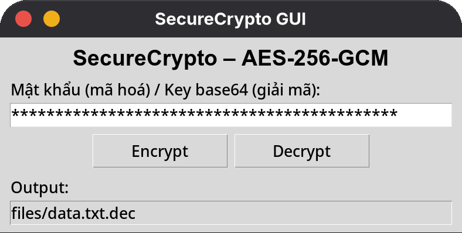
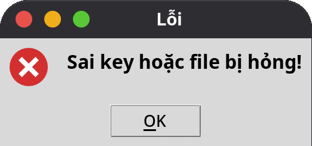
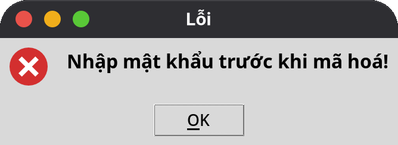

# Lab 1 – Thư viện mật mã SecureCrypto

| | |
|---|---|
| **Môn học** | Lập trình An ninh thông tin |
| **Buổi** | 2 – Mã hoá, triển khai PKI (mục 2.2) |
| **Sinh viên** | Bùi Quang Thiện – 2387700065 |

## 1. Mục tiêu

Xây dựng thư viện Python **SecureCrypto** đóng gói các thao tác mật mã hiện đại: mã hoá đối
xứng AES-256-GCM cho file, ký số và xác thực chữ ký bằng RSA, và băm mật khẩu an toàn bằng
Argon2. Thư viện được đóng gói bằng `setuptools`, có CLI, giao diện Tkinter, REST API bằng
Flask, và bộ unit test bằng `pytest`.

## 2. Kỹ năng đạt được

| Kỹ năng | Áp dụng trong bài |
|---|---|
| Mã hoá đối xứng có xác thực (AEAD) | `AES-256-GCM` mã hoá file, đảm bảo cả bí mật lẫn toàn vẹn |
| Dẫn xuất khoá từ mật khẩu (KDF) | `PBKDF2HMAC` với `SHA-256`, 100.000 vòng lặp và salt ngẫu nhiên |
| Mã hoá bất đối xứng – chữ ký số | `RSA-2048` ký (`sign`) và xác thực (`verify`) với `PKCS1v15` + `SHA-256` |
| Băm mật khẩu chống brute-force | `Argon2` (qua thư viện `argon2-cffi`) thay vì SHA thông thường |
| Đóng gói thư viện Python | `setup.py` với `entry_points` tạo lệnh `securecrypto-cli` |
| Xây dựng CLI | `argparse` cho hai chế độ `--encrypt` / `--decrypt` |
| Xây dựng REST API | Flask, nhận file qua `multipart/form-data`, trả JSON |
| Xây dựng GUI desktop | Tkinter, chọn file bằng `filedialog` |
| Viết unit test cho mã bảo mật | 6 test: encrypt/decrypt round-trip, hash đúng/sai mật khẩu, ký/xác thực đúng/sai |
| Kiểm thử API thủ công | Postman và `curl` để gọi `/encrypt`, `/decrypt` |

## 3. Công nghệ sử dụng

| Công nghệ | Vai trò |
|---|---|
| `cryptography` (PyCA) | AES-GCM, PBKDF2HMAC, RSA sign/verify |
| `argon2-cffi` | Băm và xác thực mật khẩu bằng Argon2 |
| Flask | REST API `/encrypt`, `/decrypt` |
| Tkinter | Giao diện desktop tối giản |
| `pytest` | Unit test |
| `setuptools` | Đóng gói thư viện, tạo lệnh CLI |

## 4. Luồng xử lý



## 5. Cấu trúc thư mục

```
crypto-toolkit/
├── securecrypto/
│   ├── __init__.py
│   ├── aes_utils.py        # PBKDF2 + AES-256-GCM: encrypt_file_aes / decrypt_file_aes
│   ├── rsa_utils.py        # RSA: generate_rsa_keypair / sign_data_rsa / verify_signature_rsa
│   ├── hash_utils.py       # Argon2: hash_password_secure
│   ├── cli.py              # CLI: securecrypto-cli --encrypt/--decrypt
│   ├── api.py              # Flask API: POST /encrypt, /decrypt
│   └── app_gui.py          # Giao diện Tkinter
├── images/                 # Ảnh chụp giao diện Tkinter cho README
├── tests/
│   ├── test_aes_utils.py
│   ├── test_hash_utils.py
│   └── test_rsa_utils.py
├── files/data.txt          # File mẫu dùng để test mã hoá
├── requirements.txt        # pytest (các phụ thuộc runtime khai báo trong setup.py)
└── setup.py
```

## 6. Chức năng

| Hàm | Mô tả | Thuật toán |
|---|---|---|
| `encrypt_file_aes(filepath, password)` | Mã hoá file, trả về khoá AES dạng base64 | PBKDF2HMAC-SHA256 (salt 16 byte) sinh khoá 32 byte, AES-256-GCM (nonce 12 byte) |
| `decrypt_file_aes(encrypted_file, key_base64)` | Giải mã file `.enc` bằng khoá base64 | AES-256-GCM, tách salt/nonce/ciphertext từ file |
| `generate_rsa_keypair(key_size=2048)` | Sinh cặp khoá RSA | RSA, số mũ công khai 65537 |
| `sign_data_rsa(data, private_key)` | Ký số dữ liệu | RSA + PKCS1v15 + SHA-256 |
| `verify_signature_rsa(data, signature, public_key)` | Xác thực chữ ký, trả `True`/`False` | RSA + PKCS1v15 + SHA-256 |
| `hash_password_secure(password)` | Băm mật khẩu an toàn | Argon2 (tham số mặc định của `argon2-cffi`) |

## 7. Kết quả thực hiện

### 7.1 Unit test: 6/6 test đạt

```
$ pytest tests/ -v
tests/test_aes_utils.py::test_encrypt_decrypt PASSED                     [ 16%]
tests/test_hash_utils.py::test_hash_password_and_verify PASSED           [ 33%]
tests/test_hash_utils.py::test_wrong_password_verification PASSED        [ 50%]
tests/test_rsa_utils.py::test_rsa_keypair_generation PASSED              [ 66%]
tests/test_rsa_utils.py::test_sign_and_verify PASSED                     [ 83%]
tests/test_rsa_utils.py::test_verify_invalid_signature PASSED            [100%]
============================== 6 passed in 0.54s ===============================
```

### 7.2 CLI

```
$ securecrypto-cli --encrypt ./files/data.txt --password pass123
Fu3JxhLf84qLexBIDI1ghA0SYczcyyA0iZFLN2P++GQ=

$ securecrypto-cli --decrypt ./files/data.txt.enc --password "Fu3JxhLf84qLexBIDI1ghA0SYczcyyA0iZFLN2P++GQ="
Decrypted. Output: ./files/data.txt.dec

$ cat ./files/data.txt.dec
HUTECH University
```

### 7.3 REST API (Flask + Postman/`curl`)

```
$ curl -X POST http://127.0.0.1:5000/encrypt -F "file=@files/data.txt" -F "password=pass123"
{"key":"3bI1+38/WLJA/LuIf2LyGf4rnYA7DegrM5rwm/OBtTk="}

$ curl -X POST http://127.0.0.1:5000/decrypt \
    -F "file=@securecrypto/upload/data.txt.enc" \
    -F "password=3bI1+38/WLJA/LuIf2LyGf4rnYA7DegrM5rwm/OBtTk="
{"output":".../securecrypto/upload/data.txt.dec"}

$ cat securecrypto/upload/data.txt.dec
HUTECH University
```

| Endpoint | Input | Kết quả |
|---|---|---|
| `POST /encrypt` | form-data: `file`, `password` | `{"key": "..."}`, sinh file `<tên file>.enc` trong `securecrypto/upload/` |
| `POST /decrypt` | form-data: `file` (`.enc`), `password` (khoá base64 nhận từ encrypt) | `{"output": "..."}`, sinh file `.dec` với nội dung gốc |

### 7.4 Giao diện Tkinter

Chạy từ thư mục `crypto-toolkit/` (Fedora cần cài thêm `sudo dnf install python3-tkinter`):

```
$ python3 -m securecrypto.app_gui
```

Luồng mã hoá: nhập mật khẩu, bấm **Encrypt**, chọn file. Key base64 hiện ở ô kết quả (chỉ đọc,
có thể copy) để dùng khi giải mã.

| Giao diện ban đầu | Mã hoá thành công | Key base64 trả về |
|---|---|---|
|  |  |  |

Luồng giải mã: dán key base64 vào ô nhập, bấm **Decrypt**, chọn file `.enc`. File
`files/data.txt.dec` có nội dung đúng bằng file gốc (`HUTECH University`).

| Giải mã thành công | Đường dẫn file `.dec` |
|---|---|
|  |  |

Xử lý lỗi:

| Sai key hoặc file hỏng | Chưa nhập mật khẩu |
|---|---|
|  |  |

## 8. Hạn chế và hướng cải tiến

| Hạn chế | Hậu quả quan sát được | Hướng cải tiến |
|---|---|---|
| `decrypt_file_aes` không bắt ngoại lệ khi khoá sai/file hỏng | `AESGCM.decrypt` ném `cryptography.exceptions.InvalidTag`; API trả **500 Internal Server Error** thay vì thông báo lỗi rõ ràng (đã gặp thực tế khi test qua Postman với khoá không khớp file) | Bọc `try/except InvalidTag` trong `api.py`, trả `400 Bad Request` kèm thông điệp "Sai mật khẩu hoặc file bị hỏng" |
| `decrypt_file_aes` nhận thẳng khoá base64 làm tham số `password` | Tên tham số gây hiểu nhầm là mật khẩu người dùng, dễ tưởng nhầm sang cơ chế PBKDF2 như lúc encrypt | Đổi tên tham số thành `key_base64` cho rõ nghĩa, hoặc lưu salt kèm để CLI/API chỉ cần hỏi lại đúng mật khẩu gốc |
| Không giới hạn kích thước file upload ở API | File lớn có thể làm cạn bộ nhớ khi `f.read()` toàn bộ vào RAM | Giới hạn `MAX_CONTENT_LENGTH` của Flask, đọc/ghi theo luồng (streaming) |
| GUI lưu mật khẩu dạng `Entry(show="*")` nhưng không xoá khỏi bộ nhớ sau khi dùng | Khoá còn tồn tại trong biến Python lâu hơn cần thiết | Xoá biến ngay sau khi dùng, cân nhắc dùng `getpass` cho CLI thay vì tham số dòng lệnh (tham số dòng lệnh có thể lộ qua lịch sử shell/`ps`) |

## 9. Tài liệu tham khảo

- [PyCA Cryptography Documentation](https://cryptography.io/en/latest/)
- [OWASP Cryptographic Storage Cheat Sheet](https://cheatsheetseries.owasp.org/cheatsheets/Cryptographic_Storage_Cheat_Sheet.html)
- [OWASP Password Storage Cheat Sheet](https://cheatsheetseries.owasp.org/cheatsheets/Password_Storage_Cheat_Sheet.html)
- [Argon2 – Password Hashing Competition](https://www.password-hashing.net/)
- [RFC 8018 – PKCS #5: PBKDF2](https://datatracker.ietf.org/doc/html/rfc8018)
