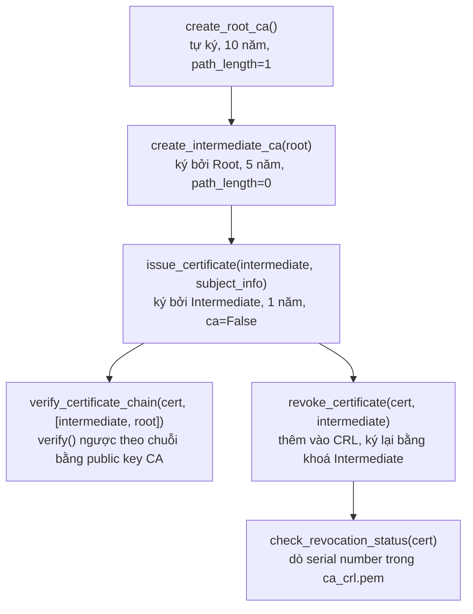

# Lab 2 – Hạ tầng khoá công khai: Mini Certificate Authority

| | |
|---|---|
| **Môn học** | Lập trình An ninh thông tin |
| **Buổi** | 2 – Mã hoá, triển khai PKI (mục 2.4) |
| **Sinh viên** | Bùi Quang Thiện – 2387700065 |

## 1. Mục tiêu

Mô phỏng một hệ thống **Public Key Infrastructure (PKI)** thu nhỏ bằng chứng chỉ **X.509**:
dựng chuỗi tin cậy Root CA → Intermediate CA → chứng chỉ người dùng cuối, xác thực chuỗi
chứng chỉ, và quản lý vòng đời chứng chỉ (thu hồi, tra cứu trạng thái) thông qua **CRL**
(Certificate Revocation List).

## 2. Kỹ năng đạt được

| Kỹ năng | Áp dụng trong bài |
|---|---|
| Hiểu cấp bậc Certificate Authority | Cài đặt đúng 3 tầng: Root CA → Intermediate CA → End-entity |
| Hiểu cấu trúc chứng chỉ X.509 | Dựng `CertificateBuilder` với subject, issuer, serial, thời hạn, `BasicConstraints` |
| Tự ký chứng chỉ (self-signed) | Root CA có `subject == issuer`, ký bằng chính khoá riêng của nó |
| Ký chứng chỉ theo chuỗi | Intermediate CA và chứng chỉ người dùng được ký bằng khoá riêng của CA cấp trên |
| Ràng buộc quyền hạn CA | `BasicConstraints(ca=True, path_length=…)` giới hạn CA trung gian không được cấp CA con |
| Xác thực chuỗi chứng chỉ | Dùng public key của CA để `verify()` chữ ký của chứng chỉ cấp dưới, lặp lại theo chuỗi |
| Quản lý vòng đời chứng chỉ | Cấp phát (`issue_certificate`), thu hồi (`revoke_certificate`), tra cứu trạng thái |
| Danh sách thu hồi chứng chỉ (CRL) | `CertificateRevocationListBuilder`, thêm `RevokedCertificateBuilder` kèm lý do thu hồi |
| Xây dựng GUI thao tác PKI | Tkinter với 5 chức năng: tạo CA, phát hành, xác thực chuỗi, thu hồi, kiểm tra trạng thái |

## 3. Công nghệ sử dụng

| Công nghệ | Vai trò |
|---|---|
| `cryptography.x509` | Xây dựng, ký, tải chứng chỉ X.509 và CRL |
| `cryptography.hazmat.primitives.asymmetric.rsa` | Sinh khoá RSA-2048 cho từng cấp CA và chứng chỉ |
| `cryptography.hazmat.primitives.serialization` | Đọc/ghi khoá và chứng chỉ dạng PEM |
| Tkinter | Giao diện desktop thao tác các chức năng CA |

## 4. Luồng xử lý



## 5. Cấu trúc thư mục

```
mini-ca/
├── ca_utils.py        # generate_key, save/load key+cert, create_root_ca,
│                       # create_intermediate_ca, issue_certificate,
│                       # verify_certificate_chain
├── revoke_utils.py    # create_empty_crl, revoke_certificate,
│                       # check_revocation_status
├── demo.py            # Kịch bản demo qua console: chạy toàn bộ vòng đời
├── demo_ui.py          # Giao diện Tkinter cho cùng kịch bản
├── requirements.txt    # cryptography
└── certs/              # Sinh ra khi chạy (đã .gitignore) – khoá riêng & chứng chỉ .pem
```

## 6. Chức năng

| Hàm | Mô tả |
|---|---|
| `create_root_ca()` | Sinh khoá RSA-2048, tạo chứng chỉ tự ký, hiệu lực 10 năm, `ca=True, path_length=1` |
| `create_intermediate_ca(root_key, root_cert)` | Tạo chứng chỉ CA trung gian, ký bởi Root, hiệu lực 5 năm, `path_length=0` |
| `issue_certificate(ca_key, ca_cert, subject_info)` | Phát hành chứng chỉ end-entity, hiệu lực 1 năm, `ca=False` |
| `verify_certificate_chain(cert, chain)` | Xác thực chữ ký số dọc theo chuỗi CA, trả `True`/`False` |
| `create_empty_crl(issuer_cert, issuer_key)` | Khởi tạo CRL rỗng, hiệu lực 7 ngày |
| `revoke_certificate(cert_file, issuer_cert_file, issuer_key_file, reason)` | Thêm chứng chỉ vào CRL kèm lý do, ký lại CRL |
| `check_revocation_status(cert_file)` | Kiểm tra serial number của chứng chỉ có nằm trong CRL không |

## 7. Kết quả thực hiện

### 7.1 Chạy kịch bản demo đầy đủ

```
$ python demo.py
Tạo Root CA...
Root CA: <RSAPrivateKey ...>, <Certificate(subject=<Name(CN=Mini Root CA Root,O=Mini Root CA,C=VN)>, ...)>
Tạo Intermediate CA...
Intermediate CA: <RSAPrivateKey ...>, <Certificate(subject=<Name(CN=Mini Intermediate CA,O=Mini Intermediate CA,C=VN)>, ...)>
Phát hành chứng chỉ người dùng cuối...
Đã phát hành: certs/Phuoc_Nguyen_cert.pem, certs/Phuoc_Nguyen_key.pem
Kiểm tra chuỗi chứng chỉ...
Chuỗi hợp lệ: True
Thu hồi chứng chỉ user1...
Đã thu hồi
Kiểm tra trạng thái OCSP của Phuoc_Nguyen_cert.pem...
Trạng thái: Revoked
```

### 7.2 Đối chiếu chuỗi tin cậy (subject/issuer/thời hạn)

| Chứng chỉ | Subject | Issuer | Hiệu lực |
|---|---|---|---|
| `root_ca_cert.pem` | `CN=Mini Root CA Root,O=Mini Root CA,C=VN` | *(tự ký, trùng subject)* | 10 năm |
| `intermediate_cert.pem` | `CN=Mini Intermediate CA,O=Mini Intermediate CA,C=VN` | `CN=Mini Root CA Root,...` | 5 năm |
| `Phuoc_Nguyen_cert.pem` | `CN=Phuoc_Nguyen,O=PHUOCNTMH Company,C=VN` | `CN=Mini Intermediate CA,...` | 1 năm |

Xác nhận đúng chuỗi tin cậy **Root → Intermediate → End-entity**, mỗi cấp có `issuer` trùng
`subject` của cấp trên, đúng nguyên lý phân cấp CA.

### 7.3 File `.pem` sinh ra trong `certs/`

```
ca_crl.pem  intermediate_cert.pem  intermediate_key.pem
Phuoc_Nguyen_cert.pem  Phuoc_Nguyen_key.pem
root_ca_cert.pem  root_ca_key.pem
```

### 7.4 Giao diện Tkinter (`demo_ui.py`)

Không kiểm thử được trong môi trường chạy thử (không có `tkinter`/màn hình đồ hoạ); đã kiểm
tra cú pháp bằng `py_compile` không lỗi. Cần chạy thử thủ công trên máy có giao diện.

## 8. Điều chỉnh so với tài liệu hướng dẫn

Cài đặt bám sát 100% mã nguồn và hướng dẫn trong tài liệu, không có thay đổi logic. Chỉ điều
chỉnh: không đưa thư mục `certs/` (chứa khoá riêng) vào repo Git — đã thêm `certs/` và `*.pem`
vào `.gitignore` theo đúng khuyến nghị bảo mật ở cuối bài (mục "xoá thông tin nhạy cảm").

## 9. Hạn chế và hướng cải tiến

| Hạn chế | Hậu quả | Hướng cải tiến |
|---|---|---|
| `check_revocation_status` được gọi là "kiểm tra OCSP" nhưng thực chất chỉ tra CRL cục bộ | Không đúng bản chất giao thức **OCSP** (Online Certificate Status Protocol), vốn cần một OCSP responder trả lời qua mạng theo thời gian thực | Triển khai thật bằng `cryptography.x509.ocsp` (`OCSPRequestBuilder`/`OCSPResponseBuilder`) và một server responder riêng |
| Chứng chỉ không có extension `CRL Distribution Points` / `Authority Information Access` | Trình duyệt hay ứng dụng thật sẽ không biết tự động tải CRL/OCSP ở đâu để kiểm tra | Thêm `x509.CRLDistributionPoints` và `x509.AuthorityInformationAccess` khi build chứng chỉ |
| Khoá riêng lưu không mã hoá (`NoEncryption()`) trên đĩa | Ai đọc được file `.pem` là lấy được khoá riêng ngay | Mã hoá khoá bằng `BestAvailableEncryption(passphrase)` khi lưu |
| CRL không tự làm mới khi hết hạn (`next_update` 7 ngày) | Sau 7 ngày, CRL trở nên "hết hạn" nhưng không có cơ chế tự tạo lại | Thêm job định kỳ gọi lại `create_empty_crl`/ký lại CRL trước khi hết hạn |
| `verify_certificate_chain` không kiểm tra thời hạn hiệu lực (`not_valid_before/after`) của từng chứng chỉ | Chứng chỉ hết hạn vẫn có thể được xác thực là "hợp lệ" nếu chữ ký đúng | Kiểm tra thêm `datetime.now()` nằm trong khoảng hiệu lực của từng chứng chỉ trong chuỗi |

## 10. Tài liệu tham khảo

- [RFC 5280 – Internet X.509 Public Key Infrastructure Certificate and CRL Profile](https://datatracker.ietf.org/doc/html/rfc5280)
- [RFC 6960 – X.509 Internet PKI Online Certificate Status Protocol (OCSP)](https://datatracker.ietf.org/doc/html/rfc6960)
- [PyCA Cryptography – X.509 Documentation](https://cryptography.io/en/latest/x509/)
- [OWASP Transport Layer Protection Cheat Sheet](https://cheatsheetseries.owasp.org/cheatsheets/Transport_Layer_Security_Cheat_Sheet.html)
