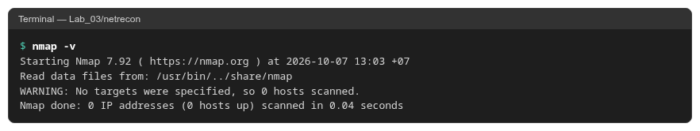
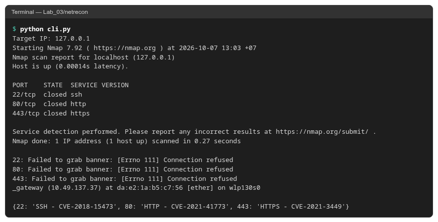
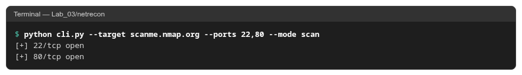
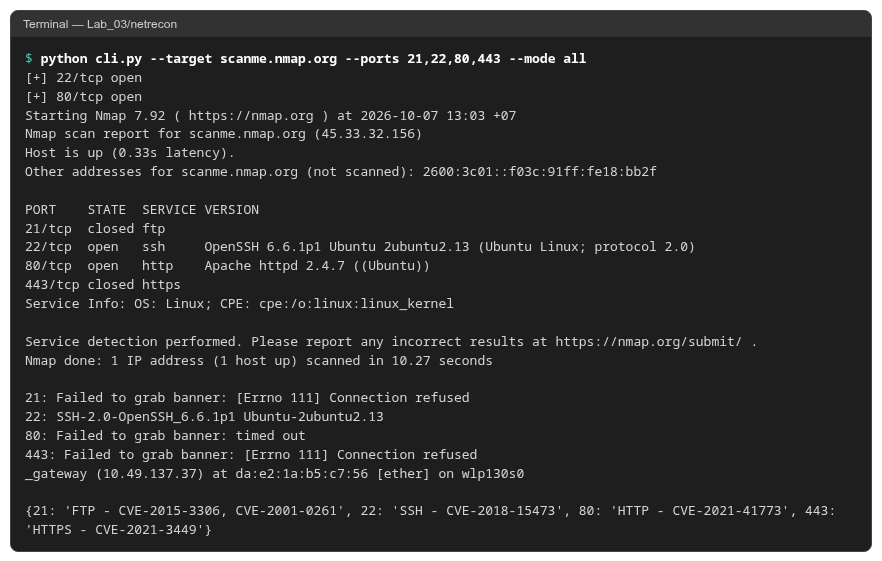
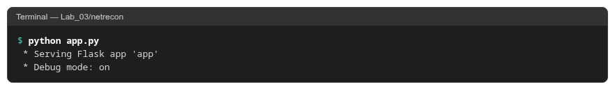
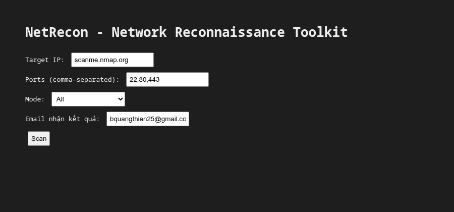
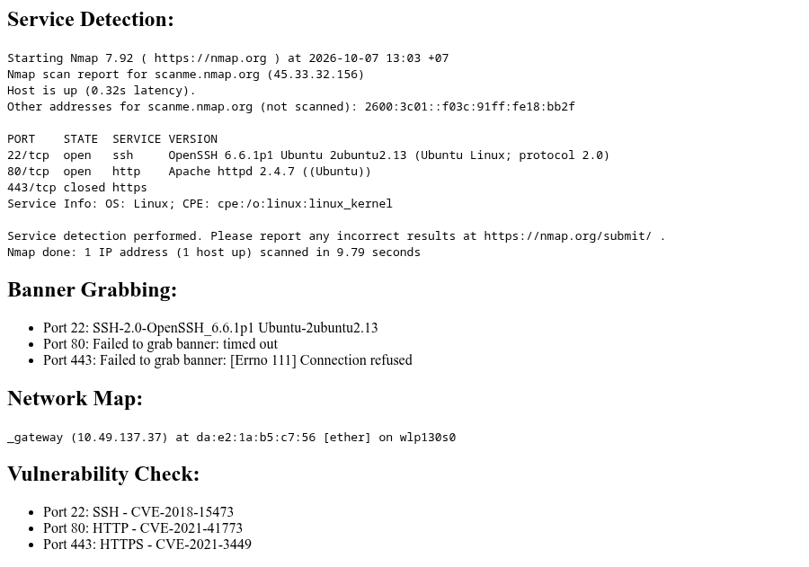

# Buổi 3 – NetRecon

Bộ công cụ trinh sát mạng: quét cổng, nhận dạng dịch vụ, lấy banner, sơ đồ mạng, kiểm tra lỗ hổng cơ bản. Có giao diện dòng lệnh (`cli.py`) và web (`app.py`).

Môi trường chạy: Fedora Linux, Python 3.14, Nmap 7.92.

## Cách chạy

```bash
pip install -r requirements.txt
python cli.py --target scanme.nmap.org --ports 22,80 --mode scan
python app.py          # mở http://localhost:5000/
```

Để gửi email kết quả, tạo file `.env` chứa `SMTP_USER` và `SMTP_PASS` (mật khẩu ứng dụng Gmail).

## Kết quả

Kiểm tra Nmap:



Chạy `cli.py`, nhập Target IP là `127.0.0.1`:



Test nhanh chế độ `scan` với `scanme.nmap.org`:



Chế độ `all` (quét cổng, nhận dạng dịch vụ, lấy banner, sơ đồ mạng, kiểm tra lỗ hổng):



Chạy `app.py`:



Giao diện web tại `http://localhost:5000/`:



Kết quả phản hồi sau khi nhấn "Scan":


