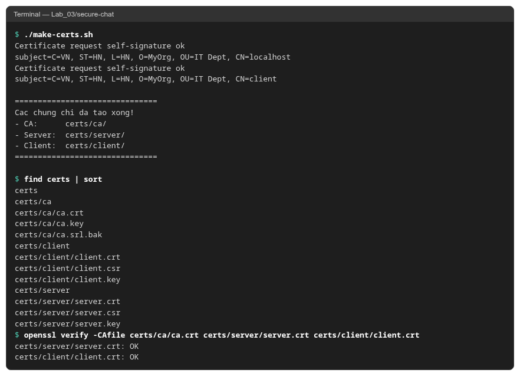
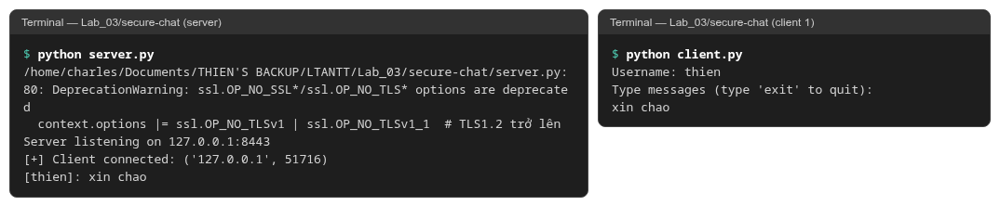
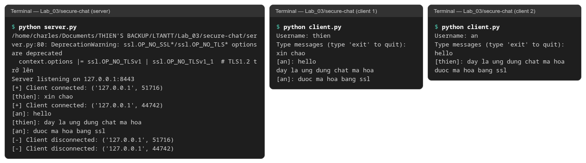

# Buổi 3 – SecureChat

Ứng dụng chat bảo mật: server đa luồng dùng SSL/TLS, xác thực client bằng chứng chỉ, tin nhắn mã hóa AES-256.

Môi trường chạy: Fedora Linux, Python 3.14, OpenSSL 3.5.

## Cách chạy

```bash
pip install cryptography
./make-certs.sh        # Windows: make-certs.bat
python server.py
python client.py       # mở thêm terminal cho mỗi client
```

## Kết quả

Tạo CA, chứng chỉ server và client (`make-certs.sh` là bản Linux của `make-certs.bat`):



Chạy `server.py` và một `client.py`:



Chạy thêm client thứ hai, hai client nhắn tin qua kênh TLS:


